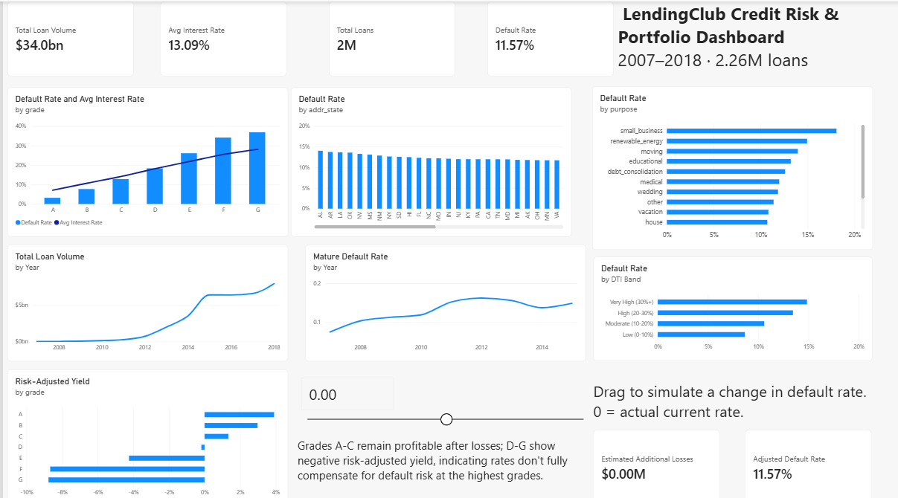
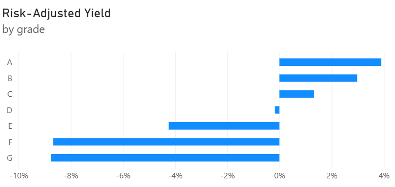
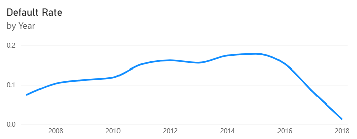
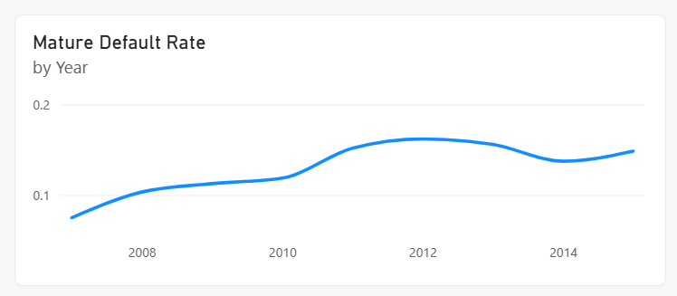

# Credit Risk & Portfolio Dashboard (Power BI)

Power BI analysis of **2.26 million LendingClub consumer loans (2007-2018)**, built to answer one question: does a lender's pricing compensate for the risk it takes on?

**Full write-up:** [Building a Credit Risk Dashboard in Power BI: What 2.26 Million Loans Reveal About a Pricing Gap at the Riskiest Grades] (https://jacksonamrobeson.blogspot.com/2026/09/building-credit-risk-dashboard-in-power.html)



## Key finding

Interest rates rise with risk grade, so pricing looks fair at first glance. But a simple risk-adjusted yield (average interest rate minus default rate) tells a different story:

| Grade | Avg interest rate | Default rate | Risk-adjusted yield |
|---|---|---|---|
| A | 7.1% | 3.2% | +3.9% |
| B | 10.7% | 7.7% | +3.0% |
| C | 14.1% | 12.8% | +1.3% |
| D | 18.1% | 18.3% | -0.2% |
| E | 21.8% | 26.1% | -4.2% |
| F | 25.5% | 34.1% | -8.7% |
| G | 28.1% | 36.8% | -8.8% |

Grades A-C stay positive, D is roughly break-even, and E-G turn clearly negative. The grading system correctly identifies who is riskier, but the extra interest on the riskiest grades does not appear to cover how much more often those loans default.



**Limitations:** this is a rough screen, not a true return. Default rate is the share of all loans charged off (including loans still "Current", which understates recent years), while interest rate is annual. It also ignores recoveries on defaulted loans and servicing costs.

## Other findings

- **Portfolio:** $34.0B across 2.26M loans (about $15,000 each); overall default rate 11.57%
- **Purpose:** small business loans default at about 18%, roughly double car loans (about 9%)
- **Debt-to-income:** the highest DTI band (30%+) defaults at about 15% vs. about 9% for the lowest (under 10%)
- **Geography:** default rates by state fall in a narrow band (about 11-14%), so state matters less than grade or purpose

## Catching a bias in the time trend

A raw default rate by year appears to improve sharply after 2016, but most loans issued in 2016-2018 had not reached the end of their 3-5 year terms, so they had not had time to default. I built a **Mature Default Rate** measure that only counts loans whose scheduled maturity date had passed as of the latest date in the data. The false improvement disappears.

| Before (raw) | After (mature loans only) |
|---|---|
|  |  |

## Data model

Star schema built mostly in Power Query, with a calendar table built in DAX:

| Table | Role |
|---|---|
| `Fact_Loans` | One row per loan: amount, rate, income, DTI, dates, outcome |
| `Dim_LoanGrade` | Risk grade and sub-grade (A1-G5) |
| `Dim_LoanPurpose` | Reason for the loan |
| `Dim_Geography` | Borrower state |
| `Dim_Date` | Calendar table, related to the loan issue date |

The dashboard also includes a **What-If slider** (simulates a shift in default rate and shows the estimated dollar impact) and a **drillthrough page** from any grade to its purpose and sub-grade detail.

## Key DAX

```
Default Rate =
DIVIDE(
    CALCULATE(COUNTROWS(Fact_Loans), Fact_Loans[loan_status] = "Charged Off"),
    COUNTROWS(Fact_Loans)
)

Mature Default Rate =
VAR AsOfDate = CALCULATE(MAX(Fact_Loans[issue_d]), ALL(Fact_Loans))
RETURN
CALCULATE(
    [Default Rate],
    FILTER(Fact_Loans, Fact_Loans[Maturity Date] <= AsOfDate)
)

Risk-Adjusted Yield = [Avg Interest Rate] - [Default Rate]
```

Supporting columns: `Term Months` (numeric loan length from the text `term`), `Maturity Date` (`EDATE` of issue date plus term), and `DTI Band` (`SWITCH` grouping of `dti`).

## Data and files

- **Source:** LendingClub consumer loan data, 2007-2018, from [Kaggle](PASTE-KAGGLE-DATASET-URL-HERE). The raw file (145 columns, about 1.1 GB) is not included.
- **Prep:** the raw CSV was trimmed to 29 relevant columns with Python (with AI assistance) before loading into Power BI. The original ID field was blank in this version of the data, so a sequential loan ID was generated.
- **Power BI file (.pbix):** 111 MB, so it is on the [Releases page](PASTE-RELEASES-URL-HERE) rather than in the repo.

## Tools

Power BI Desktop, Power Query, DAX, Python

## About

Part of my self-directed portfolio of finance and analytics projects: [Jackson Robeson's Precision Lab](https://jacksonamrobeson.blogspot.com)

## License

MIT
